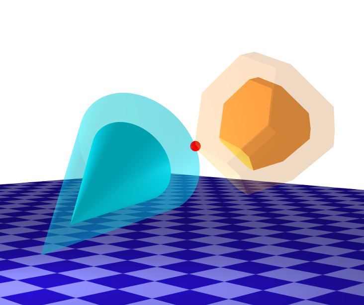
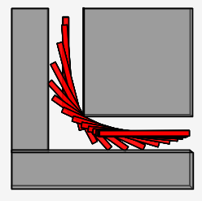
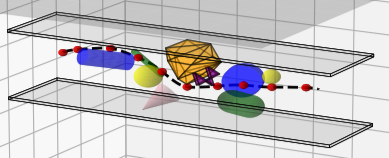

# AMR24-FP6-DCOL

This repo contains the code for a differentiable collision detection system, using several shapes as convex primitives. 



By Benedetta Rota (1936424), Camila Rota (1936447), Simone Palumbo (1938214)


## Table of Contents

- [Introduction](#introduction)
- [Installation](#installation)
- [Usage](#usage)
- [Results](#results)
- [Systems](#systems)
- [Acknowledgements](#acknowledgements)

## Introduction

This project aims to develop a differentiable collision detection system, re-implementing in Python [this Julia library](https://github.com/kevin-tracy/DifferentiableCollisions.jl/tree/master?tab=readme-ov-file)


## Installation

To install and set up this project locally, follow these steps:

1. **Clone the repository:**
   ```bash
   git clone https://github.com/DIAG-Robotics-Lab/AMR24-FP6-DCOL.git
   ```

2. **Navigate to the project directory:**
   ```bash
   cd AMR24-FP6-DCOL
   ```

3. **(optional) Create a virtual environment**
   ```bash
   python -m venv venv
   source venv/bin/activate
   ``` 
   This will keep things cleaner


4. **Install dependencies:**
   ```bash
   pip install -r requirements.txt
   ```

## Usage

After installation, you can use the project as follows:

1. **Run the application:**
   Run the script speciying the system you want to simulate
   ```bash
   python main.py --system <system_name>
   ```

## Systems
The available systems in this repo are
- **Piano Mover**: a piano must maneuver around a 90-degree turn in a hallway. The walls are 1 meter apart, and the “piano” (a
 line segment) is 2.6 meters long, making the path around
 the corner nontrivial.
- **Quadrotor**: a classic 6-DOF quadrotor model traverses a cluttered hallway with 12 objects in it.
- **Cone Through a Wall**: a cone must be routed through a square hole in a wall.

## Results

### Piano Mover
Running 
```bash
python main.py --system piano_mover
```
the result is the following:



### Quadrotor
Running 
```bash
python main.py --system quadrotor
```
the result is the following:



<!--
-->


### Cone Through Wall
Running 
```bash
python main.py --system coneThroughWall
```
the result is the following:
<!--
-->


## Acknowledgements

- [Differentiable Collision Detection for a Set of Convex Primitives](https://ieeexplore.ieee.org/abstract/document/10160716)
- [ALTRO Algorithm](https://bjack205.github.io/assets/ALTRO.pdf#:~:text=This%20paper%20presents%20ALTRO%20%28Augmented%20Lagrangian%20TRajectory%20Optimizer%29%2C,to%20handle%20general%20nonlinear%20state%20and%20input%20constraints.)
- [iLQR Tutorial](https://rexlab.ri.cmu.edu/papers/iLQR_Tutorial.pdf)

